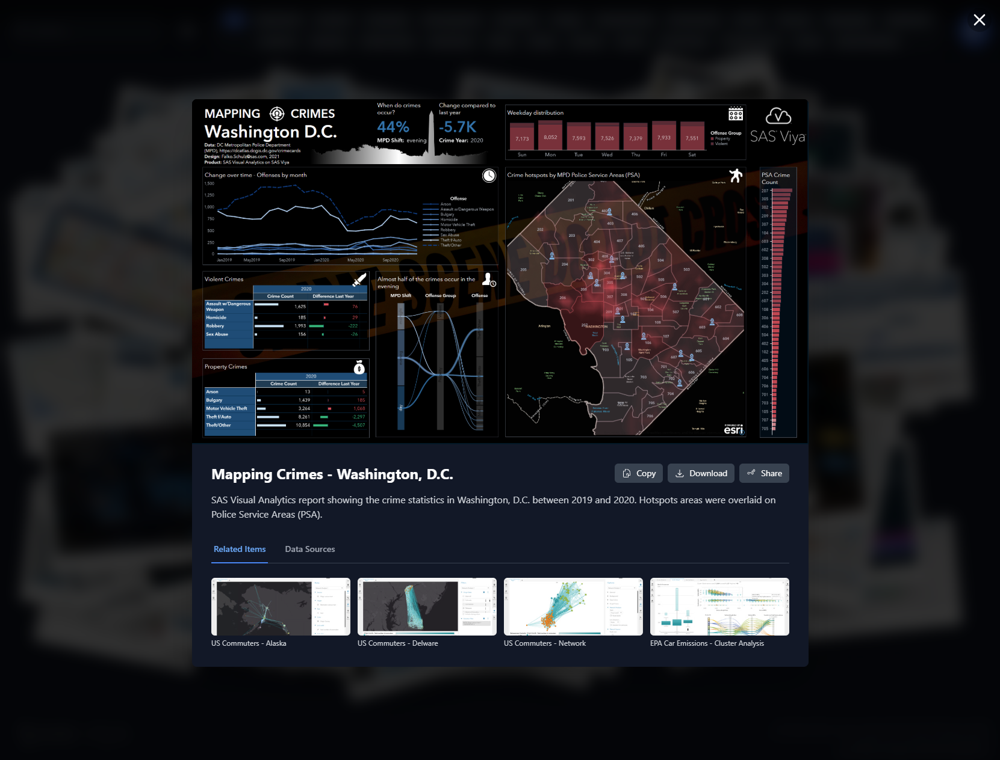

# Interactive Image Postcard Gallery

An interactive, filterable, and searchable image gallery built with React and Vite. Browse, filter, and view a collection of data visualizations and infographics. Includes modal image viewing and a slideshow feature.

## Features

- Browse a large collection of images and infographics
- Filter by category/tags
- Search by keyword
- View images in a modal with details
- Slideshow mode
- Responsive and modern UI

## Screenshots




## Getting Started

### Prerequisites

- [Node.js](https://nodejs.org/) (v18 or newer recommended)

### Installation & Local Development

1. **Install dependencies:**

   ```sh
   npm install
   ```

2. **Start the development server:**

   ```sh
   npm run dev
   ```

   The app will be available at the URL shown in your terminal (typically <http://localhost:5173>).

### Build for Production

1. **Build the app:**

   ```sh
   npm run build
   ```

2. **Preview the production build:**

   ```sh
   npm run preview
   ```

## Project Structure

- `App.tsx` - Main application component
- `components/` - UI components (Header, Postcard, Modal, Slideshow, etc.)
- `data/images.json` - Image metadata and categories (use `images.example.json` as example)
- `data/images/` - Full-size images
- `data/thumbnails/` - Thumbnails for gallery view
- `public/` - Static assets (if any)

## Customization

- To add or update images, edit `data/images.json` and place new images in the appropriate folder.

## License

MIT
